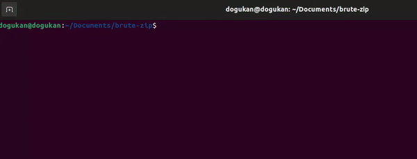

# brute-zip

## Description


Nothing fancy, just a small script for brute-forcing password-protected zip files.



## Usage

Clone this repository to your working directory:

```git clone https://github.com/dogukanteber/brute-zip.git```

You can run this script with providing a zip file and a password file. Example:

```python3 crack.py file.zip rockyou.txt```

Runner of the script must specify a password list to the script. You can download rockyou.txt file [here](https://github.com/brannondorsey/naive-hashcat/releases/download/data/rockyou.txt)

### Note

Depending on your Python version, you may need to change python3 to python. If above command does not work, try omitting 3 ie. python instead of python3.

## Dependencies

The script prints colored output therefore you may need to install termcolor module. You can easyly install using this:

```
pip install termcolor
```

If <b>pip</b> is not install on your machine, you can install using this for <b>Linux</b> and <b>MacOS</b>:

```sudo apt install python3-pip```

To install it on <b>Windows</b>, follow this link: https://phoenixnap.com/kb/install-pip-windows
